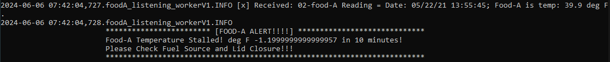
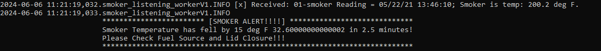

# streaming-05-smart-smoker
> Created by: A. C. Coffin | Completed: 2024 May | NW Missouri State University | CSIS: 44671-80| Dr. Case | Developing a Producer for RabbitMQ

# Overview (Updated)
Developing a Producer to read the temperature of a Smart Smoker based on specific events. This will be done through simulating temperature readings from the smart smoker of two foods. Create a producer to send these temperature readings to RabbitMQ and then three consumer processes, each monitoring one of the temperature streams. Within each consumer it must perform calculations to determine if a significant event has occurred. Each of the Consumer Scripts is an example of how deques and windowing may be applied to pull smaller sets, rather than the whole set. 
 
## Deques & Windows
Deques and windows are utilized together as a way for us to collect slices of data that are produced over a long period. They allow us to access only data we are interested in over a specified period, called a window. A deque or double-ended queue is an ordered collection of items that allows insertion and deletions from both ends. Deques are C structures that allow a large amount of flexibility. Deques have indexed access that requires two-pointer dereferences. 

In the case of the Consumers developed for this project, which use sliding windows, deques are used because they allow constant insertion and removal. This function of a deque in combination with a sliding window - a function that pulls a fixed-size subset of elements within a stream - makes it ideal to maintain boundaries during a stream. 

Windowing does not require continuous blocks of memory, which means that elements in a deque are scattered throughout memory. By doing this it allows deques to grow without needing to find a chunk of memory.


## Update for M6 6 June 2024:
This Repo was added between 31 May 2024 and 06 June 2024 to contain three separate Consumers that work in conjunction with the producer previously designed. Their associated sections have been added. Additionally, modifications to the Producer to address message errors have been made. A majority of these issues pertained to spelling and an extra message line that was unnecessary. The script temp_producerV2.py was removed due to time constraints on completing the corresponding Consumer. 

The Complete Screen Shot of the Project has been added. The Terminals are as follows:
1. temp_producerV1.py
2. smoker_listening_workerV1.py
3. foodA_listening_workerV1.py
4. foodB_listening_workerV1.py

# Screen Shot


# Table of Contents
1. [File List](File_List)
2. [Machine Specs](Machine_Specs)
3. [Prerequisites](Prerequisites)
4. [Before you Begin](Before_you_Begin)
5. [Creating Environment & Installs](Creating_Enviroment_&_Installs)
6. [Data & Project Specifics](Data_&_Project_Specifics)
7. [Developing Producer](Developing_Producer)
8. [Developing Consumer](Developing_Consumer)
9. [Running Producer/Consumer](Running_Producer/Consumer)
10. [Results](Results)
11. [References](References)

# 1. File List
| File Name | Location | Type | Module # |
| ----- |----- |----- |----- |
| util_about.py | utils Folder | Python Script | M5 |
| util_aboutenv.py | utils Folder | Python Script | M5 |
| util_logger.py | utils Folder | Python Script | M5 |
| aboutenv.txt | utils/util_outputs folder | Text | M5 |
| util_about.txt | utils/util_outputs folder | Text | M5 |
| v2_emitter_of_tasks.py | BaseCode_Samples folder | Python Script | M5 |
| smoker-temps.csv | main repo | CSV | M5 |
| temp_producerV1.log | logs folder | log | M5, Updates: M6 |
| temp_producerV1.py | main repo | Python Script | M5, Updated: M6|
| smoker_listening_workerV1.py | main repo | Python Script | M6 |
| foodA_listening_workerV1.py | main repo | Python Script | M6 |
| foodB_listening_workerV1.py | main repo | Python Script | M6 |
| smoker_listening_workerV1.log | logs folder | log | M6 |
| foodA_listening_workerV1.log | logs folder | log | M6 |
| foodB_listening_workerV1.log | logs folder | log | M6 |

# 2. Machine Specs
This project was creating a Windows OS computer with the following specs. These are not required to run the repository. For further details on the machine used go to the "utils folder" and open the "util_output" folder to access the full output. The "util_about.py" was created by NW Missouri State University and was added to the repository to provide technical information. 

* Operating System: nt Windows 10
* System Architecture: 64bit
* Number of CPUs: 12
* Machine Type: AMD64
* Python Version: 3.12.3
* Python Build Date and Compiler: main with Apr 15 2024 18:20:11
* Python Implementation: CPython
* Terminal Environment:        VS Code
* Terminal Type:               cmd.exe
* Preferred command:           python

# 3. Prerequisites
1. Git
2. Python 3.7+ (3.11+ preferred)
3. VS Code Editor
4. VS Code Extension: Python (by Microsoft)
5. RabbitMQ Server Installed and Running Locally
6. Anaconda Installed

# 4. Before you Begin
1. Fork this starter repo into your GitHub.
2. Clone your repo down to your machine.
3. View / Command Palette - then Python: Select Interpreter
4. Select your conda environment.

# 5. Creating Environment & Installs (Updated)
This project uses two different environments, Anaconda, and VS Code. Follow each section to create the VS Code environment and the Anaconda environment. Remember with the Anaconda Environment this will save on the machine once created. If you previously have an Anaconda environment installed containing Pika then use that one. The Anaconda environment is not necessary for this project it was utilized to ensure the environments between VS Code and Anaconda were consistent when running the Producer and Consumers. The Producer was run in VS Code, while all three Consumers were run in separate Anaconda Terminals.

## 5a. VS Code Env
To create a local Python virtual environment to isolate our project's third-party dependencies from other projects. Use the following commands to create an environment, when prompted in VS Code set the .venv to a workspace folder and select yes.

```
python - m venv .venv # Creates a new environment
.venv\Scripts\activate # Activates the new environment
```
Once the environment is created install the following:
```
python -m pip install -r requirements.txt
```
For more information on Pika see the [Pika GitHub](https://github.com/pika/pika). 

## 5b. Anaconda Env
To create an Anaconda environment open an Anaconda Prompt, the first thing that will pop up is the base. Then we are going to locate our folder, to do this type the following:
```
cd Documents\folder_where_repo_is
# Comand to reach folder in my terminal:
 cd Documents\ACoffinCSIS44671\-streaming-05-smart-smoker
```
Once the folder has been located the line should look like this:

```
(base) C:\Users\Documents\folder_where_repo_is\-streaming-05-smart-smoker
# Result in my Terminal:
(base) C:\Users\Tower>cd Documents/ACoffinCSIS44671/-streaming-05-smart-smoker
```
To create an environment do the following:
```
conda create -n RabbitEnv # Creates Environment
conda activate RabbitEnv # Activates Environment
# This will create the environment if you want to deactivate it, enter: conda deactivate
```
After creating the environment execute each of the following step by step. These must be executed separately because we are pulling Pika from Conda Forge.

```
python --version # Indicates Python Version Installed
conda config --add channels conda-forge # connects to conda forge
conda config --set channel_priority strict # sets priority
install pika # library installation
```


## 5c. Setup Verification
To verify the setup of your environment run both util_about.py and util_aboutenv.py found in the util's folder or use the following commands in the terminal. These commands are structured for Windows OS if using MacOS or Linux modified to have them function. Run the pip list in the terminal to check the Pika installation.

```
python ".\\utils\util_about.py"
python ".\\utils\util_aboutenv.py"
pip list
```

# 6. Data & Project Specifics (Updated)
The Data was provided by NW Missouri State University as part of the Module 5 Assignment by Dr. Case. The specific requirements for the module are as follows:

We want to stream information from a smart smoker. Read one value every half minute. (sleep_secs = 30)

smoker-temps.csv has 4 columns:

* [0] Time = Date-time stamp for the sensor reading
* [1] Channel1 = Smoker Temp --> send to message queue "01-smoker"
* [2] Channel2 = Food A Temp --> send to message queue "02-food-A"
* [3] Channel3 = Food B Temp --> send to message queue "03-food-B"

**Time stamps were addressed by adding seconds to each of the times to differentiate between each reading in increments of 5 and 10 minutes depending on the number of timestamps for each minute.** 

## 6a. Required Approach
* Use your Module 4 projects (Version 2 and Version 3) as examples.
* Remember: No prior coding experience is required to take this course. Rely heavily on the working examples from earlier modules. 
* The more similar your code looks to the examples - the more credit earned.
* Vastly different approaches can be expected to earn less credit not more.
* This project should build on skills and code we've already mastered. If not, let me know and more help will be provided. 
* The primary difference should be going from 1 to 3 queue_names and from 1 to 3 callbacks. 
* Part of the challenge is to implement analytics using the tools and approach provided (don't significantly refactor the codebase during your first week of work!) 
* AFTER earning credit for the assignment, THEN create and share additional custom projects. 
It's important to note that this project only develops a Producer, we will be heavily relying on the RabbitMQ Admin Panel and logs. The logs for this project have been included in the repository to show that the message is being sent to the queue. 

## 6b. Consumers (Updated)
The requirements as stipulated in 4a created during Module 5 are the same for this project. The student is required to modify the preexisting base code to develop the consumers. Basecode samples are included in the repository and were pulled from the "streaming-04-multiple-consumers" repository.

**Consumer Specific:**
We want to know if:
1. The smoker temperature decreases by more than 15 degrees F in 2.5 minutes (smoker alert!)
2. Any food temperature changes less than 1 degree F in 10 minutes (food stall!)

Time Windows:
* Smoker time window = 2.5 minutes
* Food time window = 10 minutes

Deque Max Length(maxlen)
* At one reading every 30 seconds, the smoker deque maxlen is 5(2.5 min * 1 reading/0.5 min)
* At one reading every 30 seconds, the food deque max length is 20 (10 min * 1 reading/0.5 min)


# 7. Developing Producer 
The Producer for this project is based on a Base Code provided by Dr. Case called v2_emitter_of_tasks from the [streaming-04-multiple-consumers](https://github.com/denisecase/streaming-04-multiple-consumers). Samples of the v2_emitter_of_tasks.py can be found in the BaseCode_Samples folder and two variations on a Consumer. The entire base code was kept, with some sections modified to meet the assignment requirements. The original code included a path to the RabbitMQ Admin Website in lines 44 to 51. 

**See 7c. Producer (Updates) for modifications made to Producer in M6.**

## 7a. ProducerV1: send_message Function
This particular Producer focused on developing a Producer to stream data to 3 separate queues, smoker_queue, foodA_queue, and foodB_queue. To do this the variables were declared upfront. There were complications when the variables were placed under the entry point, so they were moved to the top under the Imported Libraries. 

```
# Declaring variables:
host = 'localhost'
input_file_name = 'smoker-temps.csv'
smoker_queue = "01-smoker"
foodA_queue = "02-food-A"
foodB_queue = "03-food-B"
```

With each of the three queues, an emphasis was placed on making them durable if RabbitMQ crashed but also addressed the issue of messages accumulating without a consumer to retrieve them. This was done by using `queue_delete` prior to `queue_declare`. 

```
# Delete existing queues and declares them anew to clear previous queue information.
        # use the channel to declare a durable queue for each of the queues.
        ch.queue_delete(smoker_queue)
        ch.queue_delete(foodA_queue)
        ch.queue_delete(foodB_queue)

        # use the channel to declare a durable queue
        # a durable queue will survive a RabbitMQ server restart
        # and help ensure messages are processed in order
        # messages will not be deleted until the consumer acknowledges
        ch.queue_declare(smoker_queue, durable=True)
        ch.queue_declare(foodA_queue, durable=True)
        ch.queue_declare(foodB_queue, durable=True)
```
We set the messages to publish to a specific exchange, routing_key, and message. Once established error handling was added, in case the connection to the server failed or couldn't be established. Finally, we designed the script to close when the stream was complete. This process can take a very long time, so an exception was added for a keyboard escape:

```
except KeyboardInterrupt:
         logger.info("KeyboardInterrupt. Stopping the program.")
```

## 7b. ProducerV1: main function
This portion was designed to open a CSV and iterate through each row based on the column information to the corresponding queue. There are 4 columns in the CSV, however only 3 need queues. 

When creating the read function, we use row numbers to correspond with each row's information.

```
for row in reader:
                timestamp = row[0]
                smoker_temp = row[1]
                food_A_temp = row[2]
                food_B_temp = row[3]
```

A time and date split was performed as the data could not be transformed into a Unix format, it did not contain seconds required to use this format. Next, each of the three queues was given specific messages to receive. Each message contains the following information and a logger to track the message.

```
 # Created for smoker_temp, using encode which encodes the data as a binary output
                if smoker_temp:
                    smoker_temp = float(smoker_temp)
                    # Using an f string to send data with timestamp
                    message = (f"{smoker_queue} Reading = Date: {date_split}, Time: {time_split}; temp: {smoker_temp} deg F.").encode()
                    send_message(host, "01-smoker", message)
```
Another exception handler was added in case the CSV file could not be found, or there was a value error. The CSV file does contain a Header Row, this was handled within the code. If we were to call float("Channel1") in the beginning, which is not a float value, without skipping the header we would receive an error stating that the input was not the expected data type. So with this particular code, the line was skipped in the reader using `header = next(reader)`. 

## 7c. Producer (Updates)
There were a few errors when handling the queues with the producer, these were addressed. There has also been a second message line left for each queue when experimenting with message outputs. The ProducerV2 was removed in favor of a more simplified approach. Before running the Producer the lines responsible for deleting the queue were commented out:
```
# Delete existing queues and declares them anew to clear previous queue information.
        # use the channel to declare a durable queue for each of the queues.
        #ch.queue_delete(smoker_queue)
        #ch.queue_delete(foodA_queue)
        #ch.queue_delete(foodB_queue)
```
These were deactivated to send messages to the queue without the queue deleting after the message was sent.

# 8. Developing Consumer
For this project, multiple consumers were created. The reason was to separate the temperatures based on which sensor was producing the reading. That way it is possible to track each sensor independently. Independent tracking focuses on each sensor and possibly stream the data into a separate file later. The Consumers for this project are based on a Base Code provided by Dr. Case called "v2_listening_worker.py" from the [streaming-04-multiple-consumers](ttps://github.com/denisecase/streaming-04-multiple-consumers). Samples of the v2_listening_worker.py can be found in the BaseCode_Samples folder, along with the Producer base code. 

To explain the process applied to the consumers we will examine the smoker_listening_workerV1.py.
The rest of the Consumers were developed utilizing a similar format with the exception of queue-based names and deque lengths:
```
# Deque Maxlen for each Consumer
# Smoker = 5/2 = 2.5 minute window
smoker_deque = deque(maxlen=5) 

# Foods = 20/2 = 10 minute window
foodA_deque = deque(maxlen=20) 
foodB_deque = deque(maxlen=20)
```
 
## 8a. Callback
This function was developed to process the message once pulled from the queue by the Consumer. This processing has 3 major components. The first is a basic log entry that indicates the message has been received and is designed to decode it in the entry. This was kept as a method to ensure the data entering the queue and leaving the queue were the same. Once this occurred the original basic_ack was left from the Base Code.

### 8a1. Using re Module

The message was cleaned through the use of the Library re. The re-(Regular Expressions Operations) module allows us to match expression operations within a string given a regular expression. This process relies on patterns and strings being processed as 8-bit strings ('utf-8'). In this case, we use 'Smoker is temp:' as the expression. The `(\d+\.\d+)` represents any nine digits one or more times, `\.` escapes the dot character which matches the float point in the temperature. Finally, the entire line captures a decimal number with at least one digit before and after the decimal point. 

The resulting code looks as follows:
```
body_decode = body.decode('utf-8')
temps = re.findall(r'Smoker is temp: (\d+\.\d+)', body_decode)
```
After being decoded, the float is addressed in temps_fload and finally, the new temps_float is added to the smoker_deque.
```
temps_float = float(temps[0])
smoker_deque.append(temps_float)
```
### 8a2. Creating the Alert
The alert indicating when the smoker had dropped in temperature was created by analyzing the number of elements within the smoker_deque and applying a basic equation.

```
if len(smoker_deque) == smoker_deque.maxlen: # Counts each element in the deque
        # creates a trigger that is a result of the temp >= 15
        # subtracts the new temp collected from the first entry of the deque 
        if smoker_deque[0] - temps_float >= 15: 
            smoker_change = smoker_deque[0] - temps_float
```
If the temperature change has indicated a decrease in temperature by at least 15 degrees F, based on the data in the window an Alert is generated.

```
logger.info(f'''
                        ************************ [SMOKER ALERT!!!!] *****************************
                        Smoker Temperature has fell by 15 deg F {smoker_change} in 2.5 minutes!
                        Please Check Fuel Source and Lid Closure!!!
                        *************************************************************************
                        ''')
```
## 8b. Main Function
Most of the base code remains when examining this portion of the Consumer. The logic to establish the connection is the same except the following:

```
# Used to delete the queue once the message is received.
channel.queue_delete(queue=qn)

# and do not auto-acknowledge the message (let the callback handle it)
        channel.basic_consume( queue=qn, on_message_callback=callback, auto_ack=False)
```
Auto_ack was set to False to prevent the queue from acknowledging the message, and deleting it before it was processed. By adding this line it ensures the message is handled correctly.

The smoker Consumer when run with the Producer should produce the following results:


# 9. Running Producer/Consumer
Executing this grouping of Producers and 3 Consumers requires a series of steps, follow each of these carefully. When utilizing multiple consumers always activate the Consumers first. By doing this method, we can see if the queues are being emptied by the Consumers properly. 

It is possible to run each of the consumers individually, there are screenshots within the Screen Shots folder documenting their successful run during development. However, in this case, we want to utilize all 3 consumers with the Producer.
**Before Running Producer and Consumers, make sure RabbitMQ is running, it will not work if it isn't.**

1. Open 3 Anaconda Prompt Terminals
2. In each terminal set the file path to where the repo sits. Use the following structure to access this folder path.

```
cd Documents\folder_where_repo_is
# Comand to reach the folder in my terminal:
 cd Documents\ACoffinCSIS44671\-streaming-05-smart-smoker
```
3. Activate the created RabbitEnv within each terminal.
` conda activate RabbitEnv`

The fully set up terminal should look similar to the image:

Once in the terminal type command:
`python temp_producerV1.py`


4. In the first terminal run the Consumer, "smoker_listening_workerV1.py"
```
python smoker_listening_workerV1.py
```

5. In the second terminal run the Consumer, "foodA_listening_workerV1.py"
```
python foodA_listening_workerV1.py
```

6. In the third terminal run the Consumer, "foodB_listening_workerV1.py"
```
python foodB_listening_workerV1.py
```

7. In VS Code Open a Terminal and run the Producer, "temp_producerV1.py"
```
python temp_producerV1.py
```
Once active, it will ask if you want to open RabbitMQ's Admin Panel, answer as you like, a y = yes and n = no. When the code is transmitting the boxes in RabbitMQ will change to green and say running. 


Minimize the RabbitMQ Admin Dash after signing in - this will be helpful to troubleshoot if something goes wrong.

Your screen should look like this once each of the four terminals has been properly set up:


The Producer on it's own should look similar to this as it processes messages and logs the information. 


The temp_producer(Terminal 1) with Smoker Consumer(Terminal 2) and FoodA Consumer(Terminal 3):


8. Watch the Terminals
As each of the terminals executes its own script, the information should move between the Produce and Consumers. Based on that information the following alerts can be seen:




# 10. Results
This is the final output, complete with a message added to the logging data for the solo producer and active alerts for when the temperature drops between the Smoker, FoodA, and FoodB.


1. Producer: temp_producerV1.py
2. Consumer: smoker_listening_workerV1.py,
3. Consumer: foodA_listening_workerV1.py,
4. Consumer: foodB_listening_workerV1.py

# 11. References
Module 5.1: Guided Producer Design: [https://nwmissouri.instructure.com/courses/60464/pages/module-5-dot-1-guided-producer-design?wrap=1](https://nwmissouri.instructure.com/courses/60464/pages/module-5-dot-1-guided-producer-design?wrap=1)

Module 5.2: Guided Producer Implementation: [https://nwmissouri.instructure.com/courses/60464/pages/module-5-dot-2-guided-producer-implementation?wrap=1](https://nwmissouri.instructure.com/courses/60464/pages/module-5-dot-2-guided-producer-implementation?wrap=1)

streaming-04-multiple-consumers by Dr. Case [https://github.com/denisecase/streaming-04-multiple-consumers](https://github.com/denisecase/streaming-04-multiple-consumers)

Module 6.1: Guided Consumer Design: [https://nwmissouri.instructure.com/courses/60464/pages/module-6-dot-1-guided-consumer-design](https://nwmissouri.instructure.com/courses/60464/pages/module-6-dot-1-guided-consumer-design)

Module 6.2: Guided Consumer Implementation: [https://nwmissouri.instructure.com/courses/60464/pages/module-6-dot-2-guided-consumer-implementation](https://nwmissouri.instructure.com/courses/60464/pages/module-6-dot-2-guided-consumer-implementation)

Python class collections.deque: [https://docs.python.org/3/library/collections.html#collections.deque](https://docs.python.org/3/library/collections.html#collections.deque)

re — Regular expression operations: [https://docs.python.org/3/library/re.html](https://docs.python.org/3/library/re.html)
pika GitHub: [https://github.com/pika/pika](https://github.com/pika/pika)


